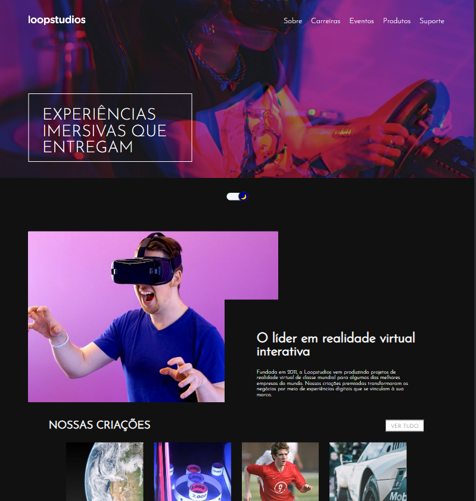

# Frontend Mentor - Loopstudios landing page solução

Esta é uma solução para o [desafio da página de destino do Loopstudios no Frontend Mentor](https://www.frontendmentor.io/challenges/loopstudios-landing-page-N88J5Onjw). Os desafios do Frontend Mentor ajudam você a melhorar suas habilidades de codificação criando projetos realistas.
## Table of contents

- [Visão geral](#overview)
  - [O desafio](#the-challenge)
  - [Screenshot](#screenshot)
  - [Links](#links)
- [Processo](#my-process)
  - [Construído com](#built-with)
- [Autor](#author)

## Visão geral

### O desafio

Os usuários devem ser capazes de:

- Visualize o layout ideal para o site, dependendo do tamanho da tela do dispositivo
- Veja os estados de foco para todos os elementos interativos na página do seu projeto e atualize o caminho do arquivo na imagem acima.
- Modo Claro e Escuro para melhor visualização

### Screenshot

  #### Modo Escuro

  #### Modo Claro
  

### Links

- Solução URL: [Github Codigo](https://github.com/Guivieirasilva/loopstudios-landing-page-main)
- Site Online URL: [Site On](https://loopstudios-landing-page-by-gui.netlify.app/)

### Construído com

- Marcação semântica com HTML5
- [React](https://reactjs.org/) - JS Biblioteca
- [Styled Components](https://styled-components.com/) - Estilização

## Autor

- LinkedIn - [Guilherme Vieira](https://www.linkedin.com/in/guilherme-vieira-silva/)
- Frontend Mentor - [@Guivieirasilva](https://www.frontendmentor.io/profile/Guivieirasilva)
- GitHub - [Guivieirasilva](https://github.com/Guivieirasilva)

